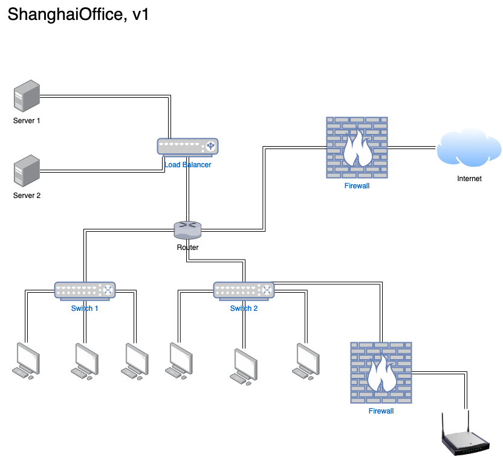
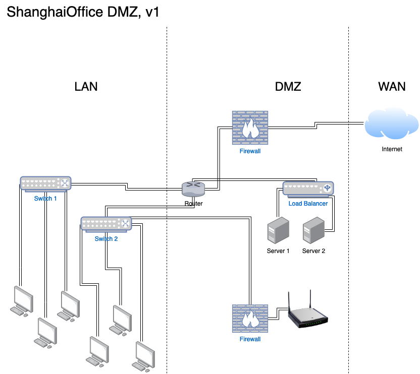

## Solution Guide: Network Devices

To complete this activity, you had to design a network layout for the new Shanghai office using **Gliffy**. 

---
The solution below is a general guideline. There are many ways to design the Shanghai network with the required devices. Use the following as a guide for reviewing your own design.

It's important that your design includes the following characteristics: 

  1. The internet is protected by a firewall.
  2. The load balancer is placed after the firewall.
  3. The switches come after the router.
  4. The computers come after the switches.
  5. The server can be placed in many places, as long as it is behind the load balancers.
  6. There is a firewall between the wireless access point and the network.
  7. The firewall for the wireless access point connects somewhere in the network (behind the router).

  

### Bonus
 
Add the following:

  9. An additional firewall separating the load balancer and servers from the LAN.

  10. A line indicating the separation of the DMZ, LAN, and WAN.

  

---
© 2023 edX Boot Camps LLC. Confidential and Proprietary. All Rights Reserved.
