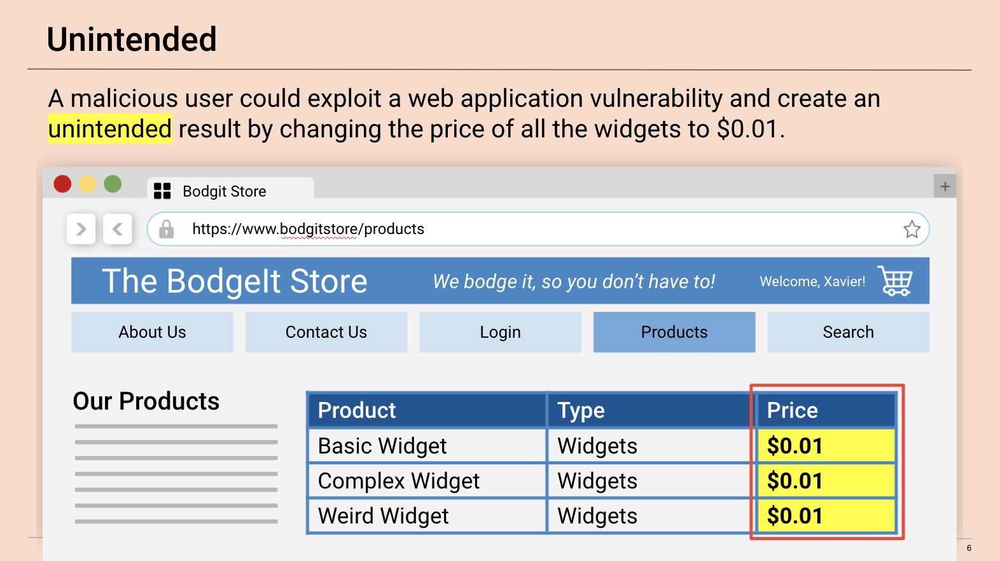
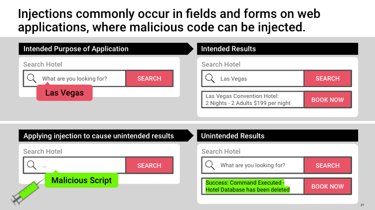
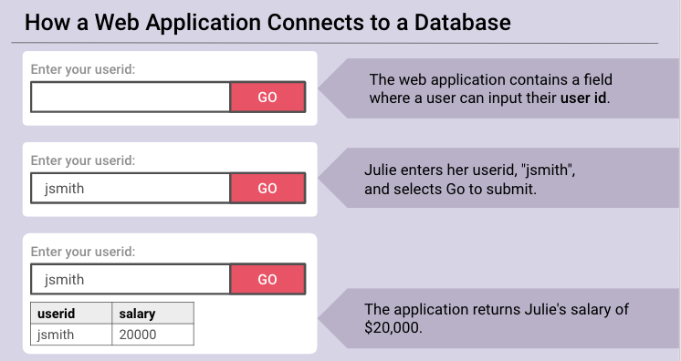
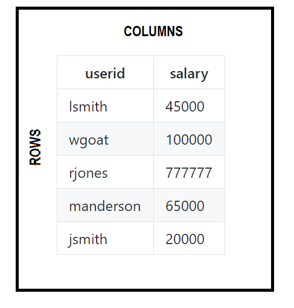
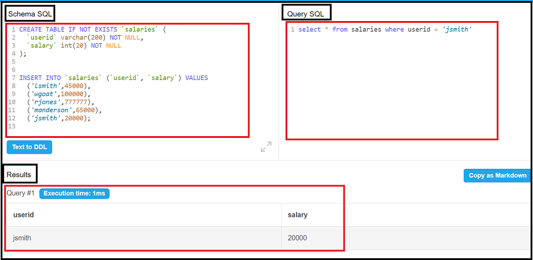
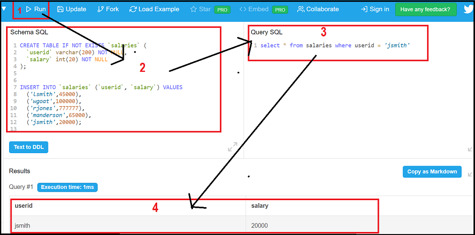
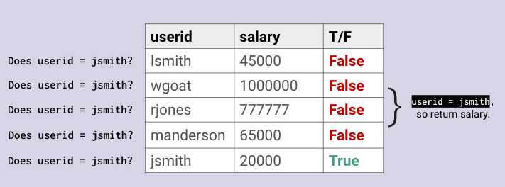
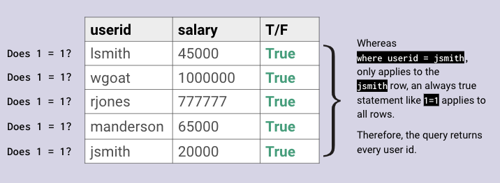
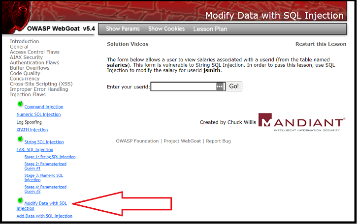

## 15.1 Student Guide: Introduction to Web Vulnerabilities and Hardening
 
### Overview

Today's lesson introduces web vulnerabilities and using the OWASP Top 10 to categorize and prioritize them. We will focus on injection vulnerabilities, specifically SQL injections and cross-site scripting.

### Class Objectives

- Articulate the intended and unintended functionalities of a web application.

- Identify and differentiate between SQL and XSS injection vulnerabilities.

- Design malicious SQL queries using DB Fiddle. 

- Create payloads from the malicious SQL queries to test for SQL injection against a web application.

- Design malicious payloads to test for stored and reflected cross-site scripting vulnerabilities.


### Slideshow 

- [15.1 Slides](https://docs.google.com/presentation/d/1Z4u06rWzTvqTSfzZ5hWEtPQvE0rbIfhZxBHX82zNaAs/edit)

---

### 01. Introduction to Web Vulnerabilities 

In the previous week, we covered the following:

  - How HTTP requests and responses work to make a web application function.
  
  - How to maintain a user's session using cookies.
  
  - The various stacks of a common web architecture and how the components within these stacks work together.
  
  - How the database component works within a web application.
  
  - How to write and run basic SQL queries against a database.
  
#### Intended vs. Unintended  
  
These concepts contribute to the **intended** functionalities of a web application. Intended functionalities with web applications could include:

  - Purchasing a product.
  
  - Uploading and displaying an image.
  
  - Posting a message in a guestbook.
  
  - Viewing your balance on a bank account.

Unfortunately, there are malicious actors who will try to exploit weaknesses that might exist in these functions to cause **unintended** consequences. These weaknesses are called **web vulnerabilities**.

The following example shows one common intended function of a web application. We can contrast that with how a malicious user could exploit a vulnerability within that application to create unintended consequences.

- **Intended**: The intended functionality of the sample webpage allows users to purchase different widgets at various prices.
  
  
 
- **Unintended**: A malicious user could exploit a web application vulnerability and create an unintended result by changing the price of all the widgets to $0.01.
  

Significant impacts can occur due to these vulnerabilities:

- **Financial impact**: In the previous example, the malicious actor can exploit the web application and purchase widgets for a significantly reduced cost.

- **Legal impact**: If a web application has a vulnerability that exposes confidential user data, a business could be subject to penalties.

- **Reputational impact**: If a web application has a reputation for being down, or dangerous due to web vulnerabilities, customers will likely look for another business.
        
    
### OWASP    

The expansiveness of the web and its various technologies, coding languages, and architectures leads to new capabilities. With these capabilities come many potential vulnerabilities. 

With so many potential vulnerabilities, how do security professionals identify and manage the top issues that could impact web applications?

Fortunately, the **OWASP** project aims to help organizations secure their web applications:

- [OWASP](https://owasp.org/) (The Open Web Application Security Project®) is "a nonprofit foundation that works to improve the security of software through community-led open-source software projects, hundreds of local chapters worldwide, tens of thousands of members, and leading educational and training conferences."

- OWASP provides free online documentation and training material to assist organizations with their development of secure code.

- OWASP is also well-known for their Top 10 list of web application risks: [OWASP: Top Ten Web Application Security Risks](https://owasp.org/www-project-top-ten/)

    

The OWASP Top 10 represents a consensus from the OWASP community of the most common and critical security risks to web applications.

- This list represents web application risks, and each risk contains various vulnerabilities. 
    
    - Note that one vulnerability could have multiple risks.
    
    - For example, SQL injection, which will be covered today, is related to two of the OWASP Top 10 risks: injection and cryptographic failures.

- Organizations can use this list to prioritize risks that might impact their applications.

- The list gets reviewed frequently and is updated when necessary (the latest revision was updated in 2021).

- Refer to the following link: [OWASP: Top Ten Web Application Security Risks](https://owasp.org/www-project-top-ten/).

- It is quite common to see interview questions about the OWASP Top 10. 
    
This week we’ll be referring to the OWASP Top 10 to examine several of the most prominent and dangerous web vulnerabilities.

#### Attack vs. Vulnerability

Throughout this week, we might see the terms **attack** and **vulnerability** used seemingly interchangeably.
 
  - For example, you might see the terms **SQL injection vulnerability** and **SQL injection attack**.
      
  - The vulnerability is the weakness within a function of the web application that can be exploited.

  - The attack is the method or action used to exploit the vulnerability.
  
#### Career Context

We will cover many web application vulnerabilities and demonstrate how to exploit them. Familiarity with these vulnerabilities and the methods used to exploit them are important skills for several cybersecurity careers:

- **Web application developers**: While web application developers might not work directly in cybersecurity, understanding vulnerabilities and their impact can help them create secure code.

- **Application security engineers**: Application security engineers work alongside developers to ensure that they develop secure code.

- **Penetration testers**: Penetration testers who test an organization's web applications need to understand these vulnerabilities, attack methods, and impacts to conduct a thorough penetration test.

#### Week Overview

The week will proceed as follows:

- **Day 1**: We will begin today with the number three risk from the OWASP list&mdash;**injection**. We will cover injection vulnerabilities such as SQL injection and cross-site scripting.

- **Day 2**: We will cover web application vulnerabilities that exist within back-end components, such as directory traversal and file inclusion.

- **Day 3**: We will cover identification and authentication failures and learn how to exploit these vulnerabilities with advanced tools such as Burp Suite.

With each web application vulnerability that we introduce, we will cover the following:

 - The intended purpose of the original function

 - The vulnerability and method of exploit

 - Unintended consequences of the exploit

 - Mitigation of the vulnerability

 - The potential impact of the exploit
 
In this week's activities, you will play the role of application security analysts at a bioengineering company called Replicants.

- While Replicants does bioengineering well, the company faces challenges developing a secure website.

- You were hired as an application security analyst in charge of keeping their web applications secure.

- Replicants just received an anonymous email stating that their web application has many web vulnerabilities. Unfortunately, the email does not identify what these vulnerabilities are.

- Because you are responsible for keeping the company's data secure, you will be tasked with testing for vulnerabilities on Replicants' application and providing recommendations for mitigation.

| ⚠️ **Important!** ⚠️|
|:-:|
| The techniques we will learn throughout this unit can be used to cause serious damage to an organization's systems. This is ILLEGAL when done without permission. All of the labs we provide are safe locations to test the methods and tools taught during the week. 
You should NEVER apply any of these methods to any web applications that you do not own or do not have clear, written permission to be interacting with.|

### 02. Injections 

The OWASP Top 10 provides valuable information about the most common and critical security risks to web applications.

The number three item on this list is **injection**, which will be the primary focus in today's class.
 
- Injection attacks occur when an attacker supplies untrusted input to an application. That malicious input, also known as a **payload**, contains malicious data or code that is then processed as part of a query or command that alters the way a program is intended to function.

- Injections commonly occur in fields and forms on web applications, where malicious code can be injected.

An injection attack can be applied to a field on a hotel-booking web application: 

  

- The top half shows the intended function of a user searching for hotels in Las Vegas by inputting "Las Vegas" in the field.

- The application returns an intended result of a hotel that the user can book.

- The bottom half shows a malicious user entering a malicious script in the same field.

- In this example, the application returns an unintended result&mdash;deleting the whole database of hotels.
      
#### Injection Types 
  
While injection involves submitting an untrusted input, not all applications handle input the same way.

  - How applications work with input depends on their design, architecture, and functionality.

  - For example, applications can do the following with user input:

    - Run a command against their operating system.
   
    - Modify the code of the website to change the way the webpage is displayed.
   
    - Run a command against a SQL database.
  
  - This range of possible interaction with user input creates multiple **injection types** that can be applied to vulnerable applications.

-  Two injection types and their dependencies:

    1.  **Cross-site scripting**: This injection is a submitted user input that can run malicious scripts against the website. It depends on the application taking in malicious user input that inadvertently executes user-supplied code.

    2. **SQL injection**: In this injection type, a submitted user input can run SQL commands against a database. It depends on the application running queries against a SQL database.
  
  These are just two of the many types of injection vulnerabilities. If you want to learn about other types of injections not covered in this class, refer to the following resource: [ESDS: What are Injection Attacks and Their Types?](https://www.esds.co.in/blog/what-are-injection-attacks-and-their-types/#sthash.9MumFwlH.dpbs)


### 03. SQL Refresher and Unintended SQL Queries 

We just covered that there are multiple types of injection vulnerabilities, which depend on how the application is designed.

Since we have already covered how SQL databases interact with a web application, we will begin by learning about the **SQL injection** vulnerability. 

  - SQL injection works against an application by sending requests to a SQL database through user input.
  
  - It is conducted by inserting a malicious SQL statement into fields on a web application.
  
  - It is one of the most dangerous types of injection. Attackers can use it to view, change, or delete confidential data that exists within an organization's database.
          
Before we learn how to conduct a SQL injection attack, we need to understand what happens behind the scenes as an application interacts with a database. We will do this as follows:

 - Cover how a web application connects to a database.

 - Review the structure of a SQL database and a SQL query.

 - Demonstrate an intended query and the intended results.

 - Cover modification of the intended query to create unintended results.
 
#### How a Web Application Connects to a Database

For this demonstration, we will play the role of security analysts at an organization that developed a new salary lookup application. 

- The new web application is called Salary Finder.

- Employees can enter their user id and confirm their salary.

- As security analysts, we are tasked with determining whether this application is vulnerable to SQL injection.
  
The following image illustrates how the web application works when an employee, Julie Smith, views her salary:



- The screen on top shows the web application. Note that there is a field where a user can input their user id.

- The second screen shows where Julie would enter her user id of "jsmith" and select the **Go** button to submit.

- The bottom screen shows the application returning Julie's salary of "20000".

Now let's explore what occurred behind the scenes:
 
- The web application took Julie's input ("jsmith") and sent it back to the web server.

- The web server took the value of "jsmith" and submitted it to a database in a **pre-built** query to find that record.

- The database contained a salary table with a list of users and salaries like the following:

    | userid    | salary |
    | --------- | ------ |
    | lsmith    | 45000  |
    | wgoat     | 100000 |
    | rjones    | 777777 |
    | manderson | 65000  |
    | jsmith    | 20000  |

- The query found the record for "jsmith" and returned the salary "20000" to Julie.
   
This is a very simple illustration of how a web application works with a database. To further understand SQL injection, we need to better understand how a SQL query works.

#### Structure of a SQL Database & Query

Let's start by reviewing several topics covered previously:
  
- SQL databases organize data like a spreadsheet.

  - Each **row** or **record** is an item in the database, and each **column** is a piece of data in the row.
  
  - A whole spreadsheet of rows and columns is called a **table**.
  
  - A collection of tables is called a **database**.

   
  
- Let's use the previous example to review the syntax for a common SQL query:

  - `select userid, salary from salaries where userid = 'jsmith'`
    
    - `select` is used to read or select data from a table.
    
    - `userid, salary` indicates the two fields requested to be displayed.
    
    - `from salaries` instructs the program to select the data from the salaries table.
    
    - `where userid = 'jsmith'` instructs the program to only return records where the user id is "jsmith."

#### Intended Query and Results Demonstration 

Now we will conduct a demonstration to view and run intended queries against a database to understand how they return intended results.

- In a real-world application, we’d be able to go directly into the databases and run these queries. However, due to the technical constraints involved in setting up a complete database, we will use a web-based tool called **DB Fiddle** to quickly and easily create a simplified version of a database.
    
We will use DB Fiddle to view a sample of the database that this application connected to:

1. Open the following link to access the DB Fiddle sample database for this application: [DB Fiddle: SQL Database Playground](https://www.db-fiddle.com/f/pTafgskXgHYNiyc2nMC2F/5).
  
    
  
2. Using the webpage and the preceding image, note how the page is divided into three panels:
     
    - The **Schema SQL** panel builds the sample database and table. In this case, it is building the salaries table.
      
      - While it is important to understand that this is SQL code that creates and inserts data into a table, it is outside the scope of this class to cover the syntax of this code.
      
      - ⚠️ Do not modify the data within this panel as it forms the infrastructure for the lessons and activities.
    
    - The **Query SQL** panel is where you run the SQL queries against the table. In this example, this represents the query being run when the user entered "jsmith" in the field.
      
      - The query is `select userid, salary from salaries where userid = 'jsmith'`
    
    - The **Results** panel displays the results of the SQL query, which represents what was returned to the user on the webpage.
      
      - This is the record for "jsmith" with the salary of "20000".
      
        - **Note**: The results will not appear until you run the SQL query.
        
3. Let's start the process by clicking **Run** on the top left of the page.

    
            
   - When we run the query, the following steps occur:

      - The database and tables are created by running the queries in the **Schema SQL** panel.
    
      - Next, it runs the queries in the **Query SQL** panel.
    
      - Lastly, the results of the queries are displayed in the **Results** panel.
        
4. Let's look more closely at the query we just ran to learn how the application is intended to work:

   `select userid, salary from salaries where userid = 'jsmith'`

    - The application has a pre-built query, as follows: 
   
       
       
    - The user input gets added between the single quotes to make the query run as intended:
   
       
     
    - Note that we will return to this concept when we build malicious payloads.
   
Next we will learn several ways to modify this intended SQL query to return unintended results. 

#### Modification of Intended Query to Create Unintended Results

We know the intended pre-built query for the web application:

`select userid, salary from salaries where userid = ' '`

After Julie entered her user id of "jsmith", the intended query to pull the salary was updated: 

`select userid, salary from salaries where userid = 'jsmith'`
 
We will now learn a method to modify the SQL query to cause unintended results.
 
#### Always True Statement
      
The SQL query uses the conditional `where` clause, like `where userid = 'jsmith'`, to specify the desired results.

  - For example, based on `where userid = 'jsmith'`, SQL checks all the records until there is a match of the `userid` of `jsmith`:
  
    
    
  - When it matches, SQL considers this a true statement. The records that do not match are considered false.
   
We can modify the SQL query to add a second condition, called the **always true statement**.

Always true statements are used to surpass all other conditions in an SQL query. 

- **Always true** describes a condition that always has a true result.

- The most common always true statement is  `1 = 1`.

- If you had to give me a quarter every time `1 = 1`, you would always end up giving me a quarter, because 1 will always equal 1.

The following image shows how `1 = 1` would work on the same table:
  
   

  - Whereas `where userid = 'jsmith'`  only applies to the `jsmith` row, an always true statement like `'1' = '1'` applies to all rows. Therefore, the query returns every user id. 
       
  - To add this always true statement to the SQL query, we add `OR` and the always true statement as the second condition, as such:

    - `select userid, salary from salaries where userid = 'jsmith' OR '1' = '1'`
   
#### Always True Demonstration

Return to DB Fiddle and test an always true statement. 

1. In the SQL Query panel, enter `select userid, salary from salaries where userid = 'jsmith' OR '1' = '1'`.
   
    - Note that SQL will now check for two conditions:
      
      - `select userid, salary from salaries where userid = 'jsmith'` is the original condition, which will return the true record of "jsmith".
      
      - The second condition, `OR '1' = '1'`, will return ALL the other rows in the table, as all the other rows are true. 
 
2. Run the query and note that now the results return all the rows in the table:

    | userid    | salary |
    | --------- | ------ |
    | lsmith    | 45000  |
    | wgoat     | 100000 |
    | rjones    | 777777 |
    | manderson | 65000  |
    | jsmith    | 20000  |

3. While `'1' = '1'` is one of the most common always true statements, you can use different always true statements as long as the values equal each other:

    - For example:

      - `'dog' = 'dog'`
    
      - `'123' = '123'`
    
      - `'cloud' = 'cloud'`

    - These alternatives could be beneficial if an application is designed to block or alert on the most common statement.

4. Return to DB Fiddle and run the query with a different always true statement to illustrate that it returns the same results:
  
   - `select userid, salary from salaries where userid = 'jsmith' OR 'cat' = 'cat'`

In the next section, the always true method will be used to build a malicious SQL injection payload.

#### Summary
  
  - Web vulnerabilities are weaknesses that exist within the intended functions of web applications.

  - The OWASP Top 10 is a published list of the top 10 most common and critical security risks to web applications.

  - Number three on this list is **injections**, attacks that supply untrusted input (the **payload**) to an application that is processed as part of a query or command and alters the intended functionality of a program.

  - One of the most impactful types of injection is **SQL injection**, which depends on web applications that apply user input to a database.

  - A web server can take the user input and apply it to a database using SQL queries.

  - A method to modify an intended SQL query is to add **always true statements**.

  
### 04. SQL Refresher and Unintended SQL Queries Activity

- [Activity File: SQL Refresher and Unintended SQL Queries](Activities/03_SQL_Refresh/Unsolved/README.md)

### 05. SQL Refresher and Unintended SQL Queries Review


- [Solution Guide: SQL Refresher and Unintended SQL Queries](Activities/03_SQL_Refresh/Solved/README.md)

Ask any questions that remain beforefans proceeding.

### 06. Testing SQL Injection on Web Applications 
    
Since we were tasked with finding SQL injection vulnerabilities, we will now focus on the web application and conduct the following steps:

1. Test the intended purpose of the application.

2. Design malicious payloads by using the SQL queries built in the previous activity.

3. Test SQL injection on the application by using those payloads.
   
#### Demo Setup
 
- Access the OWASPBWA URL.

- On the webpage, select OWASP WebGoat (be sure not to select OWASP WebGoat.NET).

- When prompted to log in, enter the following credentials:

  - User: `webgoat`

  - Password: `webgoat`

- After logging in, select **Injection Flaws** on the left side of the screen.

  - Select the sub-option of **Modify Data with SQL Injection**.

  - The page should look like the following image:

      

#### SQL Injection Demonstration

1. We will begin by testing the intended purpose of the application. 
 
    - This live webpage is a Salary Finder application. The intended function of this web application is for employees at an organization to check their salary.

    - We will begin by testing Julie Smith's user id: "jsmith".

      - Enter the user id of "jsmith" and click **Go!**

      - Note how it returns the salary:
    
        | userid    | salary    |
        | --------- | --------- |
        | jsmith    | 20000     |`
     
   - The intended **pre-built** query for the application is:
  
     - `select userid, salary from salaries where userid='  '`
       
   - When we entered "jsmith" and clicked **Go!**,  the input was added between the single quotes to make the query run as intended:
   
     - `select userid, salary from salaries where userid='jsmith'`

   - If another user, William Goat, wanted to view his salary, he would enter the user id as "wgoat".

     - This returns the salary as intended:
  
        | userid    | salary    |
        | --------- | --------- |
        | wgoat     | 100000    |
            
    - In this case, `wgoat` is the value between the single quotes:

      - `select userid, salary from salaries where userid='wgoat'`

    - Now that we know how the web application works as intended, we will revisit the SQL queries to design some malicious payloads.
 
2. Use the SQL queries built in the previous activity to design malicious payloads.
 
   - We just confirmed that what was entered into the input field gets added between the quotes of the SQL query:

      

     - Understanding that the input goes between the quotes, is an important part of designing a SQL injection attack.
 
   - Let's revisit the unintended SQL query we used with the always true statement:

      - `select userid, salary from salaries where userid='smith' OR '1'='1''`
  
   -  In order to run this query, we only have to grab the part of the SQL query BETWEEN the quotes, shown in red: 

      
      
      - There is no single quote before `jsmith` or after the last `1`. 

    - Note that this input that causes the malicious action is considered the payload. 

3. Use the payloads to test SQL injection on the application.
 
   - Enter the payload as shown in the following image, and select **Go!**

     

   - Note that, similar to the results we saw in DB Fiddle, we were able to return all the rows that exist in the salaries database:

     

Since we were able to modify the intended functionality of the website with a malicious payload, we can confirm that this application is in fact **vulnerable to SQL injection**.
   
#### Real-World Challenges and Impact
 
**Real-world challenges**: Note that while the purpose of the lesson was to illustrate how a SQL injection payload can create unintended results, in the real world we need to be aware of several issues not covered in this lesson.

- **Access to database structure** 

  - In the demonstration we were able to view a back-end database and tables to help construct the payload. In the real world, application security analysts would not have access to the database tables or structure. 
  
  - Security analysts would be required to figure out the query being applied and test multiple payloads to determine which payload will end up working.
  
- **Variety of databases**

  - In the real world there are multiple database types in which SQL queries will not work the same way.

    - For example, we successfully ran a SQL injection attack with the following payload: 

      - `select userid, salary from salaries where userid = 'jsmith' OR '1' = '1'`

    - Another database might not require single quotes around their input values, as follows:  

      - `select userid, salary from salaries where userid = 'jsmith OR 1 = 1'`

  - Security analysts would also have to try multiple payloads to determine which ones will end up working.

    - 📚 The following resource lists thousands of available SQL injection payloads to test: [SQL Injection Payload Tutorial](https://techyrick.com/sql-injection-payload-tutorial/).
  
- **Variety of attacks**

  - While the demonstration illustrated one method in which all data was displayed from a table, there are SQL injection attacks that can delete or alter data.
    
**Impact**: The reason that SQL injection is considered one of the most harmful attacks is due to the potential impact.

  - If a malicious actor successfully launches a SQL injection attack against an organization's database, they might be able to view, change, or delete the organization's confidential data.

  - Also note that SQL injection can also lead to attacks against the OS itself, such as an attack called **Command Injection**, which will be covered in this week's homework.

    - 📚 The following article explains more about how SQL injection can lead to command injection attacks: [Microsoft | Docs: xp_cmdshell (Transact-SQL)](https://docs.microsoft.com/en-us/sql/relational-databases/system-stored-procedures/xp-cmdshell-transact-sql?view=sql-server-ver15)

#### Mitigation Methods

We just learned that a SQL injection attack is conducted by inputting a malicious payload into an input field.
 
Input validation is a common method used to mitigate this attack.

- Define **input validation** as a method to validate the data input with a predefined logic, ensuring that the input is what the application is expecting.

  - Input validation is added by a web developer when they design the application's code.

- The predefined logic can be a parameter.

  - For example, an application might ask for an email, as shown in the following image:
  
    
  
  - If the user enters an email address with an incorrect format, like "user.email.com", the application will run its logic against the user input to validate that it is correct. 
    
  - Because it is not correct, the application will reject the input and tell the user to correct the format of their input:
  
    
  
Input validation can be applied on the client side or the server side.

- **Client-side input validation** involves coding the predefined logic into the webpage.

    - For example, an input can only be chosen from a predefined drop-down menu.

- **Server-side input validation** involves adding the predefined logic into the code on the web server.

    - For example, if a user enters a malicious SQL code and selects submit, then the web server will check and remove it after receiving this malicious input.

- It is considered best practice to use server-side input validation, as methods can be applied to bypass client-side input validation.

    - Bypassing client-side input validation will be covered on Day 3 of this week.
     
#### SQL Injection Summary

 - **The intended purpose of the original function**: Web applications interact with SQL databases by placing user input into SQL queries to display or modify data.

 - **The vulnerability and method of exploit**: SQL injection involves a malicious user inserting a payload to run unexpected results. 

 - **The unintended consequence of the exploit**: The unintended consequences is the SQL query running a different query than intended.

 - **The mitigation of the vulnerability**: Mitigation can be achieved by applying input validation code logic to the client- and server-side code.

 - **The potential impact of the exploit**: The impact could include the unauthorized viewing, modification, or deletion of an organization's confidential data within their databases.
 

### 07. Testing SQL Injection on Web Applications Activity

- [Activity File: Testing SQL Injection on Web Applications](Activities/06_SQL_Injection/Unsolved/README.md)

### 08. Testing SQL Injection on Web Applications Activity  Review


- [Solution Guide: Testing SQL Injection on Web Applications](Activities/06_SQL_Injection/Solved/README.md)

### 09. HTML and JavaScript (0:10)

So far, we've covered:

  - **Injection**, the number one web application risk on the OWASP Top 10, happens when an application takes untrusted input that alters the intended functionality of a program.

  - **SQL injection**, one of the most dangerous types of injection vulnerabilities, depends on an application applying user input to a SQL database.

  - How to conduct a SQL injection attack by entering a malicious payload into an untrusted field.
  
**Cross-site scripting**, or **XSS**, is another injection type that occurs when an application takes in malicious user input that inadvertently executes user-supplied code.

In the next section, we will cover how this malicious user input can execute user-supplied code.

#### XSS Scenario
 
Cross-site scripting can allow an attacker to enter payloads into the source code of a webpage to cause unintended consequences. Let's look at the following example: 

    

  - AwesomeBikes.com is an online message board intended for users to recommend bike models, ask questions, and chat about everything related to cycling. 

  - The intended use involves users entering their messages into a text box. Those messages will then display on the message board. 

  - However, because this site is vulnerable to injection attacks, a malicious user can input a script in the text box. Rather than post the text of the script to the message board, the webpage will interpret the script as code. 
  
  - This code will infect any user who subsequently visits AwesomeBikes.com. 

Depending on the specific script that the user inputs, the impact on subsequent visitors can include a number of potential actions, such as the following:

- Redirecting to a spoof page where the malicious user can then try to sell fake products and capture credentials. 

- Stealing the user's cookies.

- Adding a keylogger onto the user's machine. 

- Downloading malware to the user's machine. 

In order to learn how XSS exploits affected webpages, we first need to look behind the scenes of a webpage and learn how the source code creates the displays that we interact with when visiting. 
  
To better understand how the webpage source code works, we will cover the following:

  - **HTML:** A language used to build the structure of a webpage.

  - **JavaScript:** A language used to make webpages interactive and dynamic.

#### HTML

When a user enters a URL in a browser and the browser displays a webpage, several high-level steps occur behind the scenes.

  - For example, if you want to access Google.com:

    - **Step 1:** You enter "google.com" in the search bar on the top of your browser and press Enter.

    - **Step 2:** Your browser sends a request to Google's web server.

    - **Step 3:** Google's web server returns an HTML file to your browser.

    - **Step 4:** Your browser renders the HTML file to display what you see on the webpage.
    

**HTML**, or **Hypertext Markup Language**, is a language used to display the content on a webpage.

  - It is a considered a **client-side language**, as it is designed to run on the user's client, the browser.

  - HTML contains **elements**, which can define the following:

    - The boundaries of a paragraph on a webpage, like where a paragraph starts and ends.

    - The size and boldness of headings on a webpage.
    
    - The placement of embedded images, video, or audio.

  - HTML elements use **tags** and **angle brackets** `< >` to delineate the HTML structure of a webpage.

    - For example, the `<html>`, `<body>`, and `<H1>` tags introduce content into a webpage.
 
Let's look at an example of HTML code:

  ```html
    <html>
    <body>
    <h1>I love Application Security!</h1>
    <h2>Excited to try Cross Site Scripting!</h2>
    </body>
    </html>
 ```
    
Break down the HTML elements as follows, and use the following image as a reference:
 
    
 
  - `<html>` and `</html>`: 

    - `<html>`: Indicates the start of HTML code. 

    - `</html>`: Closes the HTML. (Note that a forward slash `/` indicates end of script.)

  - `<body>` and `</body>`: 

    - `<body>`: Indicates the contents or attributes of the webpage. 

    - `</body>`: Closes the body of the HTML script.

  - `<h1>I love Application Security!</h1>`:

    - `<h1>`: Indicates a heading on a website.

    - `I love Application Security!`: The text to be displayed in the heading. 

    - `</h1>`: Closes the header. 

  - `<h2>Excited to try Cross Site Scripting!</h2>`:

    - `<h2>`: Indicates a heading, but at a smaller size. 

    - `Excited to try Cross Site Scripting!`: The text to be displayed in the heading. 

    - `</h2>`: Closes the header. 
    
Let's see what the webpage will look like when the browser renders this code:
 
 

 Note the following about what is displayed:

   - None of the tags themselves are displayed on the page, only the text between the tags.

   - The `<h1>` tag tells the browser to display the text of `I love Application Security!` at a specific size.

   - The `<h2>` tag tells the browser to display the text of `Excited to try Cross Site Scripting!` at a smaller size.
 
These are just a few of the many available HTML tags. We will soon explore other tags, including the following:

   - `<b>` for bolding text

   - `<u>` for underlining text
  
 If you want to explore many other HTML tags, refer to the following resource: [W3Schools: HTML Element Reference](https://www.w3schools.com/TAGS/default.ASP).
 
#### JavaScript

While HTML provides options that can improve the aesthetic and design of a webpage, it still has limitations to static improvements and cannot create more dynamic features. 

**JavaScript** is a programming language that allows web developers to add complex web features that dynamically update web content and add life to a webpage. These features include the following:

  - Animations

  - Audio and video playback

  - Interactive games and maps

  - Online chats

JavaScript is also considered a client-side language, as it is designed to run on the user's browser. It is added into the HTML code by adding a `<script>` tag.

Let's look at the previous sample HTML code again, this time with an added JavaScript tag:

 

- Break down the syntax of the added JavaScript tag:

   - `<script>`: Indicates the start of the JavaScript.

   - `alert("I love javascript")`: A JavaScript alert script used to create a pop-up that states "I love javascript!"

   - `</script>`: Closes the JavaScript.
   
- Let's see what the webpage will look like when the browser renders this new code: 
 
  

- This image shows that the JavaScript made a pop-up appear.

This is just one example of the many types of scripts that JavaScript can run.

- 📚 If you want to learn more about Javascript, refer to the following resource: [W3Schools: JavaScript Tutorial](https://www.w3schools.com/js/DEFAULT.asp).

#### Web Application Demonstration
 
- Access OWASPBWA URL (see Lab Setup for instructions).

- On this webpage, select OWASP WebGoat.NET (be sure not to select OWASP WebGoat again).

- After logging in, select **Cross Site Scripting (XSS)** on the left side of the screen.
  
  - Select **Stored XSS**.
  
  - The page should look like the following image:

      
    
In this demonstration we will continue to play the role of a security analyst at an organization. The organization developed a company guestbook where employees could post comments or messages. The messages posted are displayed to all subsequent visitors. We are tasked with testing this application for vulnerabilities. 

1. First, we will test the intended purpose of the application.

    - Note how the webpage works:

      1. A user enters their email.

          - Enter Julie's email: `julie@replicant.com`.

      2. A user enters their comment.
          
          - Enter a comment for Julie:  `Hacking is fun`.

      3. The user selects **Save Comment** to submit the data to the web server.
          
          - Select **Save Comment**.
     
      
     
    - After completing these steps, note how the user input changed the content that is displayed on the webpage. Specifically, point to the data that you just entered.
  
        
  
2. We will now look at the source code that makes up this webpage and find the comment that we just entered. 

    - The best way to view the source code is to right-click on the webpage and select **View Page Source**.
    
    - Looking at the raw HTML code, search for the message by pressing CTRL+F (Command + F for Mac) and typing "Hacking". Press Enter. 

    - Note that we can see the user input that we supplied in the comment field. It has been added into the HTML code to modify how the webpage is displayed:

      - `<br/>Hacking is fun<br/>`
  
         

3. The steps of the application's intended function:

    - **Step 1:** A user enters input on the web application page.

    - **Step 2:** The user input is taken by the application and sent over to the web server to be stored.

    - **Step 3:** The same user (or a different user) revisits the same web application page.

    - **Step 4:** The web server takes the input that was stored and updates the HTML file.

    - **Step 5:** The updated HTML file is sent back to the user's browser.

    - **Step 6:** With the HTML file, the browser renders the updated webpage to be displayed to the user.
  

4. Next we will test some unintended causes of this application. 

    - Return to the webpage, and enter data to modify the source code of the webpage:

      1. Enter Julie's email again: `julie@replicant.com`.
      
      2. Enter a comment for Julie that includes the HTML tags used to underline the text:
      
          - The `<u>` and `</u>` tags underline text. 
      
          - Place them before and after the message (as shown in the image):

            - `<u>Hacking is SUPER fun</u>`
      
      3. Select **Save Comment**.
  
       
    
    - After completing these steps, note how the user input has changed the content that is displayed on the webpage. Specifically, note that now "Hacking is SUPER fun" (or whatever message you entered) is underlined:
  
       
  
    - Let's look at the raw source code again to see what was changed. 

      - Right-click on the webpage and select **View Page Source**.
    
      - Press CTRL+F, then enter the first word of the message you typed (for example, "SUPER") and press Enter.
    
    - Note that we were able to add HTML tags such as `<u>` to modify how the page was displayed. Additionally, anything we type in the message field gets added between the `<br/>` and `<br/>`.
  
      - `<br/><u>Hacking is SUPER fun</u><br/>`  
  
          
  
      - Additionally, note that anything we type in the message field gets added between `<br/>` and `<br/>`.
  
  Note that now that we have demonstrated that we can modify the source code of the HTML with user input, in the next lesson we will learn how to enter scripts into the fields to cause more malicious consequences. 

  - We have not yet demonstrated cross-site scripting, only how to modify the HTML of a webpage.
      
### 10. Testing XSS on Web Applications 

We just demonstrated how we can modify the source code of a webpage by entering HTML tags into the input field. 

- If the application allows us to enter JavaScript in the same field, we can run unintended scripts. 

- This type of web application attack is known as  **cross-site scripting**.
    
**Cross-site** scripting is a web application attack that injects malicious scripts into vulnerable web applications.

 - While cross-site scripting is technically an injection risk, it is now included within the broader "A03:2021 - Injection" category on the OWASP Top 10 list. In previous versions, it had its own risk category, but as of 2021, it is part of the injection risks covered in the OWASP Top 10 list.

 - While cross-site scripting is an injection attack similar to SQL injection, the impacts are different for the following reasons: 

   - SQL injection impacts the organization's web application database by displaying, modifying, or deleting data.

   - Cross-site scripting impacts the users of the organization's web application.
 
 - There are multiple types of cross-site scripting, depending on how the application is designed:
 
   - **Reflected (non-persistent) XSS** depends on the user input being immediately returned to the user and not stored on the application's server.
 
   - **Stored (persistent) XSS** depends on the user input being stored on the application's server and later retrieved by a victim accessing the web application.

In the next demonstration, we will continue the guestbook scenario to demonstrate stored XSS. 
     
#### Stored XSS Demonstration

**Setup note**: From web lab, return to the same webpage from the previous demonstration, WebGoat.NET.
- After logging in, select **Cross Site Scripting (XSS)** on the left side of the screen .

- Select the sub-option of **Stored Cross Site Scripting**.

So far, we have tested the following:

  - The intended purpose of the application (by entering the user input `"Hacking is fun"`).

  - An unintended method (by adding HTML elements, as in `<u>Hacking is SUPER fun</u>`).
  
  Point to your webpage and show both of these user inputs on the webpage:
  
     
   
Unless these inputs are deleted, any time any user visits this webpage, these user inputs will be displayed, because they are stored on the web application's web server.
    
Now that we have shown that the application accepted an input with HTML, we will attempt something more malicious, like inputting a script. Let's get started. 

1. Enter a malicious script in the input field.

    - Enter Julie's email again: `julie@replicant.com`

    - Enter a different comment for Julie. This time, type the following script:
    
      - `<script>alert("Julie was here.")</script>`
           
               

         - The `<script>` and `</script>` tags are the starting and ending HTML tags to run JavaScript.

         - `alert` instructs the program to display a pop-up.

         - `("Julie was here")` instructs the program to display the text "Julie was here". Note that the text needs to be placed between the double quotes.
                    
    - Click **Save Comment**.
 
   - After we save the comment, a pop-up stating that "Julie was here" appears on the screen. The script is stored on the web server and is returned every time the web application is accessed.
  
   - This pop-up confirms that we have managed to successfully exploit a stored cross-site scripting vulnerability!
  
           
  
2. Let's return to the source code and see how the input we added modifies the webpage's code.

    - Right-click the webpage and select **View Page Source**. 
    
    - Viewing the raw HTML code, hold down CTRL+F and type "here". Press Enter. 

    - Note that the input script that we added has been added to the HTML:

        - `<br/><script>alert("Julie was here")</script><br/>`  
  
    - Similar to the underline tags we added previously, the script we typed in the message field gets added between the `<br/>` and `<br/>`:

         

3. Next we'll demonstrate how the webpage is stored for subsequent users: 

    - Copy the URL of the exact webpage you are on and open either a new browser or a different tab.
    
    - Paste the URL into the different browser or tab.
    
    - After the pop-up displays, note that this demonstrates that anytime this webpage is visited, this script will be displayed.
  
#### Recap 

 - Stored XSS depends on the application storing the user input on the web application's server.

 - This is accomplished by submitting a malicious input (or payload) into the web application. The malicious input is returned to ANY subsequent user that visits the infected page on the web application. 

- In the example, we added a JavaScript tag to the HTML. Anytime a user visits the page, a pop-up will be displayed. An attacker could apply much more malicious scripts, such as the following:

  - Redirecting the user to a spoof webpage.

  - Installing a keylogger to capture what the user types on other webpages.

  - Capturing the user's cookies and sending them to the attacker.
    
- This is why cross-site scripting is extremely dangerous. The attacker can apply multiple methods of attacks to any user that visits the infected web application. 

We will now cover another type of XSS, **reflected cross-site scripting**, which has different dependencies and attack methods.
  
#### Reflected XSS Demonstration

**Setup note:** From the same webpage, WebGoat.NET, select **Cross Site Scripting (XSS)** on the left side of the screen. 

- Select the sub-option of **Reflected XSS**.

- The page should look like the following image:
     
        

Let's begin by reviewing the intended purpose of the application. 

1. This webpage allows a user to view information about the different office locations of a business.
  
   - Illustrate how it works by navigating to the URL: <http://YOUR_IP_HERE/webgoat.net/Content/ReflectedXSS.aspx>.
  
    - Remember, a **uniform resource locator (URL)** is the full address of a resource on the internet.
 
    - Recap the parts of a URL, covered previously:

      - URLs have a specific syntax that indicates where to find the resource being requested.

      - The syntax is `scheme://subdomain.domain.TLD/path/resource`. 
            
        - `scheme`: http

        - `subdomain.domain.TLD`: webgoat.net

        - `path`: /Content/
        
        - `resource`: ReflectedXSS.aspx
        
    - Note that the resource being accessed on the webpage is `ReflectedXSS.aspx`.
  
2. For example, let's say that we want to view information about an office in the Tokyo location. Click **Tokyo** and then note the following two changes to the webpage:
  
         
  
   - The URL was changed to <http://192.168.1.100/webgoat.net/Content/ReflectedXSS.aspx?city=Tokyo>. **Note:** Sample IP is used here and in subsequent examples. 

      - The resource being accessed is `ReflectedXSS.aspx?city=Tokyo`.
   
      - This resource is a **parameter** that indicates which city is being requested.
      
      - The parameter comes after the question mark: `?city=Tokyo`.
      
      - If the parameter is changed to another city, such as `?city=Boston`, then the webpage will display information about the Boston office.
    
   - The webpage data about the Tokyo office is immediately returned to the user. 

3. View the modified source code.

   - Right-click on the webpage and select **View Page Source**.
    
    - Viewing the raw HTML code, press CTRL+F and search for "Toyko".


   - The resource has been added into the HTML:

     - `<form method="post" action="ReflectedXSS.aspx?city=Tokyo" id="ctl00_Form1">`
  
            
  
   - This works very differently than stored cross-site scripting:

      - **Step 1:** We select the Tokyo option from the application.

      - **Step 2:** The link changes the URL of the webpage to look for the specific resource selected:

        - `ReflectedXSS.aspx?city=Tokyo`

      - **Step 3:** The source code of the webpage changes based on the updated URL:
        
        - `<form method="post" action="ReflectedXSS.aspx?city=Tokyo" id="ctl00_Form1">`

      - **Step 4:** This change is immediately displayed, or reflected, back to the user. 
    
    - The intended purpose of the application is to modify the source code based on the resource in the URL. 
  
    We just learned that the source code of the webpage is changed based on the resource in the URL. This means that we can think of the URL as another input location (in addition to input fields) to modify the source code of the webpage. Using this knowledge, let's test the unintended purpose of this application. 
    
4. Let's see what happens if we change the resource to a malicious payload.

    - The URL to display the data of Tokyo is <http://192.168.1.100/webgoat.net/Content/ReflectedXSS.aspx?city=Tokyo>. The resource that was added into the HTML is `ReflectedXSS.aspx?city=Tokyo`.
     
    - We will delete the Tokyo option and replace it with the same pop-up script that we used in the last activity, as follows:

           

      - `http://192.168.1.100/webgoat.net/Content/ReflectedXSS.aspx?city=<script>alert("Julie was Here")</script>`
  
    - The new resource that will be added to the HTML is `ReflectedXSS.aspx?city=<script>alert("Julie was Here")</script>`.

    - Press Enter and note that the pop-up ("Julie was here") appears.
    
           
   
    - This script is reflected back to the user, confirming that we have successfully exploited a reflected cross-site scripting vulnerability.
 
5. View the modified source code. 

   - Right-click the webpage and select **View Page Source**.
    
    - Use CTRL+F to view the message that we entered. Search "Julie" and press Enter.
    
   - The script has now been added into the HTML source code, as follows:

      - `<form method="post" action="ReflectedXSS.aspx?city=%3Cscript%3Ealert(%22Julie%20was%20Here%22)%3C/script%3E" id="ctl00_Form1">`
  
           

6. Note some characters that are a little different than what we entered into the script, such as `%22` and `%20`.

    - URLs can only accept certain values and cannot accept input like spaces and angle brackets.

    - The webpage automatically changes them to those encoded values:
    
      - `%22` represents double quotes `"`.
    
      - `%20` represents a space. 
        
    - 📚 Refer to the following link for more about encoding and decoding URLs: [MeyerWeb.com: URL Decoder/Encoder](https://meyerweb.com/eric/tools/dencoder/). 

#### Delivering a Reflected XSS Attack

Delivering a stored XSS attack simply requires inputting malicious scripts into the application. Then anyone who visits that application will have that script run.

Reflected XSS scripts need to be delivered differently, because the script is not stored on the web application. The URL must be sent to the victim, and the victim must be deceived into clicking the link. 
  
- **Phishing emails** are a common delivery method. 

   - For example, an attacker could construct a phishing email and send it to their victim with the message shown in the following image:
 
           
   
   - The email contains a link, or an icon that directs to a link, that was pre-built to open the malicious XSS URL:

     - `http://192.168.1.100/webgoat.net/Content/ReflectedXSS.aspx?city=<script>alert("Julie was Here")</script>`
    
   - After the victim is tricked into clicking on the link, they will receive a pop-up that states, "Julie was here." 

- Note that a more malicious script can run scripts that do the following:   
   
    - Redirect the user to a spoof webpage.
   
    - Install a keylogger to capture what the user types on other webpages.
   
    - Capture the user's cookies and send them to the attacker.
    
 - Note the following advantage of an attacker using reflected XSS:

   - The victim might inspect the URL before clicking on it and feel safe, because the link can come from a previously trusted webpage.

   - For example, if Instagram was infected, the URL could look like `http://instagram.com/ReflectedXSS.aspx?city=<script>alert("Julie was Here")</script>`. An unsuspecting user might see Instagram and feel secure enough to click it. 
   
Recap the following about **reflected cross-site scripting**: 

 - Reflected XSS depends on the user input being immediately returned to the user and not stored on the application's server.

 - This is achieved by sending a URL of a webpage that runs a malicious script. This is commonly done through phishing emails.

-  Reflected XSS is a client-side attack.
      
#### Real-World Challenges and Impact

**Real-world challenges**: While the purpose of the lesson was to illustrate how two types of cross-site scripting can create unintended results, in the real world we need to be aware of several issues not covered in this lesson. 

  - **Variety of attacks**
    
    - The demonstration illustrated using one script that created a pop-up.
    
    - Thousands of malicious scripts can be run by crafting more advanced JavaScript payloads.
              
**Impact**: Cross-site scripting is considered a harmful attack due to the potential impact.

- If a malicious actor applies **stored XSS** to a web application, every subsequent user that visits the infected web application will have the malicious script run, with the following impact:  

    - The victim's cookies stolen and session hijacked.
  
    - The victim's computer infected with malware.

- If a malicious actor applies **reflected XSS** to a web application by sending a phishing email to a victims, the attacker can also do the following:

  - Steal the victim's cookies and hijack their session.

  - Infect the victim's computer with malware. 

#### Mitigation Methods

We learned that a common method to mitigate SQL injection attacks is called **input validation**.

- Input validation is a method used to validate the data input with a pre-defined logic to ensure that the input is what the application is expecting.

Note that input validation is also the best method to mitigate both types of cross-site scripting.

- For stored XSS, we can use **server-side input validation** to prevent scripts from being stored on the application's web server.

  - For example, the web server might not accept, at any time, submitted input that includes `<script>` or `</script>`.
  
- For reflected XSS, the input is not stored on the web server, so it would be best to use a **client-side input validation**, in which the code might not allow a malicious user to input scripts.

#### Cross-Site Scripting Summary

 - **The intended purpose of the original function**:

   - **Stored XSS**: User's input is stored on the web application's server and, when returned, it modifies the source code of the webpage.

   - **Reflected XSS**: User's input is immediately returned to the user to modify the source code of the webpage.

 - **The vulnerability and method of exploit**:

   - **Stored XSS**: An attacker inputs a malicious script into a field, and subsequent users who access the web application will have the script run.

   - **Reflected XSS**: An attacker sends a crafted URL to a victim, likely by a phishing email. Then the victim accesses the URL and a malicious script runs.

 - **The unintended consequence of the exploit**: For stored and reflected XSS, the unintended consequence is that the source code will change on the webpage and a malicious script will run.

 - **The mitigation of the vulnerability**: For stored and reflected XSS, mitigation can be accomplished by applying input validation code logic to either the client- or server-side code.

 - **The potential impact of the exploit**: For stored and reflected XSS, the impact could include infecting the victim's computer with malware or stealing their session cookies.
 
         
### 11. Testing XSS on Web Applications Activity


- [Activity File: Testing XSS on Web Applications](Activities/09_testing_XSS/Unsolved/README.md)

### 12.  Testing XSS on Web Applications Activity Review

- [Solution Guide: Testing XSS on Web Applications](Activities/09_testing_XSS/Solved/README.md)

The following OWASP guide provides a comprehensive list of methods to protect from XSS attacks:

- [OWASP: Cross Site Scripting Prevention Cheat Sheet](https://cheatsheetseries.owasp.org/cheatsheets/Cross_Site_Scripting_Prevention_Cheat_Sheet.html)


___

© 2023 edX Boot Camps LLC. Confidential and Proprietary. All Rights Reserved.
